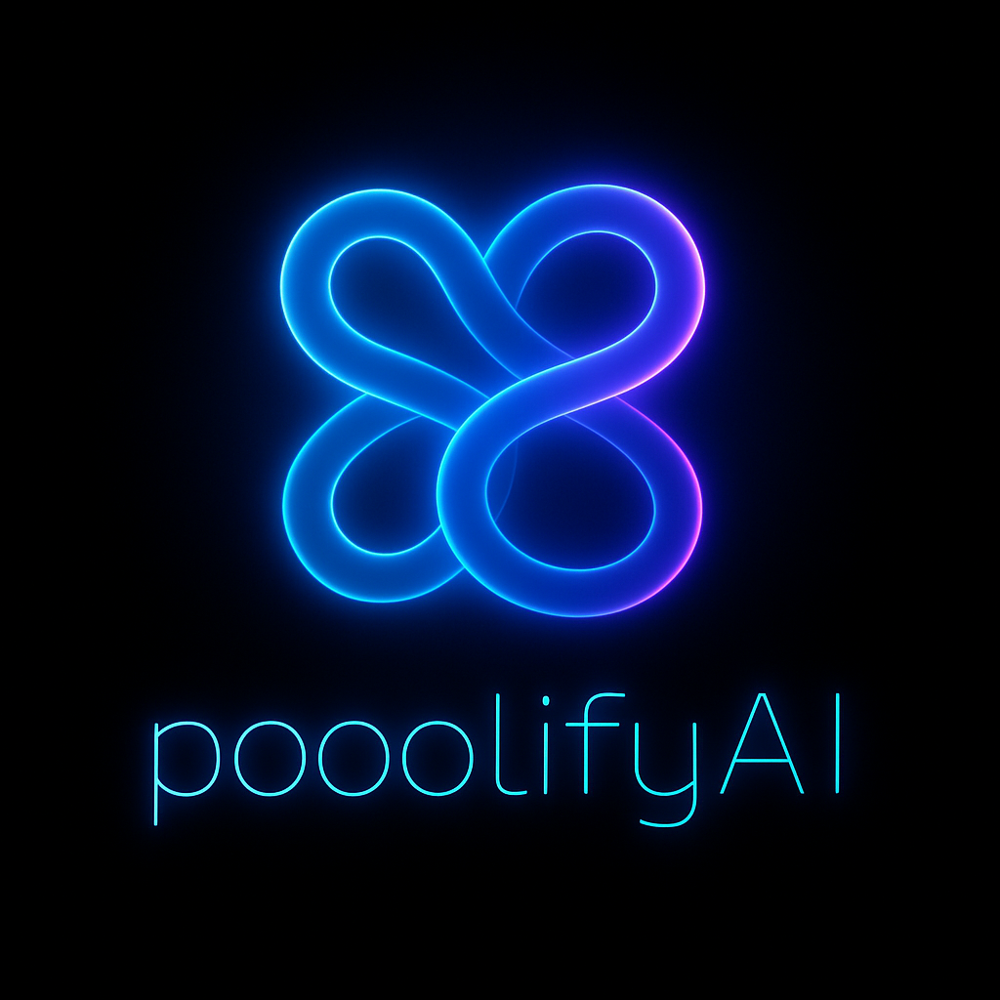

pooolify — Build multi‑AI agents backend in 1 minute

Overview

- "An AI backend framework to build and operate multi‑agent systems in minutes."
- Manager‑centric orchestration with parallel execution, clean Python DX, and full observability.

Quickstart (1 minute)

1. Clone and install

```
git clone https://github.com/Pooolingforest/pooolifyAI
cd pooolify
uv sync
# or: uv pip install -e .
```

2. Set environment

```
export LLM_OPENAI_API_KEY=sk-...   # required for gpt-5/gpt-5-high
export APP_ENV=dev                 # dev allows no auth if API_TOKEN is unset
# optional auth
# export API_TOKEN=your-token
```

3. Run an example (start here)

```
# Minimal single-agent greeter (bundled)
uv run uvicorn pooolify.examples.00_simple_agent.main:app --reload
```

4. Make a request (async processing + polling)

```
curl -X POST http://localhost:8000/v1/chat \
  -H 'Content-Type: application/json' \
  -H "Authorization: Bearer ${API_TOKEN}" \
  -d '{"session_id":"demo","query":"Say hi to Alice and summarize next steps."}'

curl -X GET http://localhost:8000/v1/sessions/demo/conversation \
  -H "Authorization: Bearer ${API_TOKEN}"
```

Add your own Agent or Tool (folder autoload)

- Agents are auto-discovered from `agent/*/index.py`.
- Tools are auto-discovered from `tools/*/index.py`.
- An optional `agent/index.py` can define the manager config.

Agent scaffold

```python
from pooolify.agents.runtime import AgentDefinition

def build_agent(tools, base_dir):
    return AgentDefinition(
        name="my_agent",
        role="Domain specialist",
        goal="Solve the user's task with clarity and brevity",
        background="Expert with pragmatic problem-solving skills",
        knowledge=(
            "Rules:\n- Keep answers short.\n- Prefer structured outputs.\n"
            "Output JSON: {\"text\": string}"
        ),
        model="gpt-5",
        tools=[],           # or [tools["internal_api"], ...]
        max_loops=1,
    )
```

Tool scaffold

```python
from pooolify.tools.base import Tool

class MyTool(Tool):
    def __init__(self) -> None:
        super().__init__(name="my_tool", description="Does something useful")

    def run(self, *, name: str) -> dict:
        return {"success": True, "output": f"hello {name}"}

def build_tool(base_dir):
    return MyTool()
```

Manager override (optional)

```python
from pathlib import Path
from pooolify.core.app import PooolifyApp

def build_manager(base_dir: Path) -> PooolifyApp.ManagerConfig:
    return PooolifyApp.ManagerConfig(
        model="gpt-5",
        system_instruction="You are the manager. Plan succinctly and route to the right agent(s).",
    )
```

API usage (recommended)

- The framework processes requests asynchronously. Recommended flow:
  - POST `/v1/chat` with `{ session_id, query }`
  - Then poll GET `/v1/sessions/{session_id}/conversation`
- See details and client examples in the API section below.

Supported LLM models

- OpenAI: `gpt-5`, `gpt-5-high`
- Set `LLM_OPENAI_API_KEY` in the environment.

Architecture overview

- Manager‑centric orchestration
  - Plans and schedules agent tasks into steps; supports parallel (PARALLEL) and isolated (ISOLATED) tasks.
  - Produces a final summary after agent runs; can loop if incomplete (bounded).
- Agents
  - Declared via `AgentDefinition` (role, goal, background, knowledge, model, tools, max_loops).
  - Per‑agent system prompt is composed automatically; optional docs in `agent/<name>/docs/` are merged into `knowledge`.
- Tools and execution
  - Tools implement a standard `Tool` interface; arguments are generated, validated, and executed with safe logging.
  - Tool plans -> arg generation -> execution -> result improvement loop.
- API and app
  - FastAPI app; POST `/v1/chat`, GET `/v1/sessions/{id}/conversation`, health endpoints.
  - Optional PostgreSQL persistence for sessions, costs, and audit trails; if DB init fails in dev, the app still runs.

Design philosophy (brief)

- Developer‑centric by default: code‑first, folder autoload, minimal boilerplate.
- Transparency & observability: structured logs and cost tracking by default.
- Model‑agnostic parallel orchestration: manager routes to multiple agents concurrently.
- Structured autonomy: grant agents context and freedom within clear boundaries.

License

- MIT License. See `LICENSE` (or include the MIT text in your distribution).
